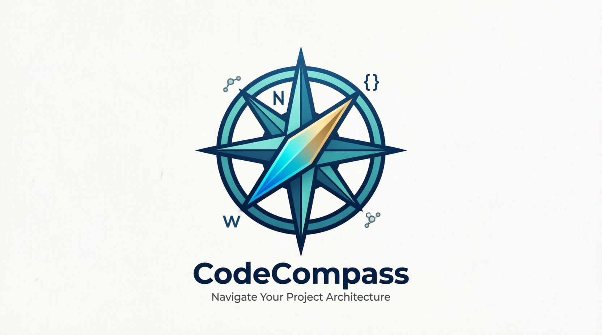

<div align="center">
  

  <br/>

  **The audit skill for Claude Code that tells you exactly what your project needs — and why.**

  <br/>

  [](https://github.com/ai-craftsman404/CodeCompass/actions/workflows/ci.yml)
  [](LICENSE)
  [](https://www.typescriptlang.org/)
  [](src/tests/)
  [](jest.config.js)
  [](https://nodejs.org/)

  <br/>

  **[▶ See real output](#see-real-output)  ·  [⚡ Try in 2 minutes](#try-in-2-minutes)  ·  [📖 Docs](#how-it-works)**

</div>

---

## See real output

This is genuine output from the recommendation engine — not a mockup.

**Scenario:** production app, small team, GDPR compliance required, high threat exposure.

```
$ /audit PROFILE_STAGE=production COMPLIANCE_FRAMEWORK=GDPR TEAM_SCALE=small THREAT_LEVEL=critical

Context : production · small team · GDPR · threat: critical
Matched : 32 rules from 110+
Phasing : YES  (score 0.72 — above 0.65 threshold)

══════════════════════════════════════════════════════════════
 PHASE 1 — Triage                                  1–2 hours
══════════════════════════════════════════════════════════════

🔴 gdpr-data-processing-agreement    [hard-mandatory]  score: 100
   GDPR Art.28: Data Processing Agreements required for all processors
   → Create: /docs/gdpr/processor-register.md

🔴 gdpr-privacy-policy               [hard-mandatory]  score: 100
   GDPR Art.13/14: Privacy notice required for personal data collection
   → Create: /docs/gdpr/privacy-notice.md

🔴 gdpr-data-retention-deletion      [hard-mandatory]  score: 100
   GDPR Art.5(1)(e): Data minimisation and storage limitation policy
   → Create: /docs/gdpr/data-retention-schedule.md

🔴 gdpr-data-subject-rights          [hard-mandatory]  score: 100
   GDPR Art.15-22: Workflows for all data subject rights requests
   → Create: /docs/gdpr/dsr-procedures.md

══════════════════════════════════════════════════════════════
 PHASE 2 — Comprehensive                           1–3 days
══════════════════════════════════════════════════════════════

🔴 gdpr-breach-notification          [hard-mandatory]  score: 97
🔴 production-sre-runbooks           [hard-mandatory]  score: 94
🟡 ci-security-scanning              [soft-mandatory]  score: 78
🟡 production-disaster-recovery      [soft-mandatory]  score: 74
🟡 test-integration-add-e2e          [soft-mandatory]  score: 68
🟢 obs-structured-metrics-alerts     [advisory]        score: 61
   … 26 more recommendations

Rationale provided for every rule · Conflicts resolved · Artifact paths listed
```

**Change one flag, get a completely different set of recommendations:**

```bash
# Solo developer, early stage — minimal rules, no overwhelm
/audit PROFILE_STAGE=PoC TEAM_SCALE=solo

# LLM application going to production
/audit PROFILE_STAGE=production AI_PATTERN="LLM API" THREAT_LEVEL=high

# Enterprise system, ISO 27001
/audit PROFILE_STAGE=production TEAM_SCALE=enterprise COMPLIANCE_FRAMEWORK=ISO27001
```

---

## Try in 2 minutes

**You need:** [Node.js 18+](https://nodejs.org) and [Claude Code](https://claude.ai/code)

```bash
git clone https://github.com/ai-craftsman404/CodeCompass.git
cd CodeCompass
npm install && npm run build
```

Open **any project** in Claude Code, then type:

```
/audit
```

That's it. Claude asks 3–4 questions, infers context from your repo, and returns a prioritised recommendation set. Expect results in under 60 seconds.

> **Skip the questions** — if you already know your context, pass flags directly and go straight to results (see [expert flags](#expert-flags-reference)).

---

## What is CodeCompass?

CodeCompass is a **Claude Code skill** that audits any software project against 110+ contextual rules — and only surfaces the ones that apply to your specific situation.

Most audit tools give every project the same advice. CodeCompass doesn't. It scores rules against your project's **stage, team size, compliance obligations, AI patterns, and threat level**, then resolves conflicts between competing rules using a weighted precedence engine.

A solo developer building a PoC gets different advice from a regulated enterprise shipping to production — and rightly so.

**What sets it apart:**

| | |
|---|---|
| 🎯 **Context-filtered** | 110+ rules — only relevant ones surface |
| ⚖️ **Precedence-scored** | Critical rules always win; no recommendation buries another |
| 📋 **Compliance-ready** | GDPR, ISO 27001, SOC2, HIPAA, PCI DSS, FedRAMP, EU AI Act, NIST AI RMF, Cyber Essentials |
| 🤖 **AI-native** | Dedicated rules for LLM APIs, RAG pipelines, agentic systems, fine-tuning |
| 📅 **Phase-aware** | Large high-threat projects split into Triage (1–2 h) + Comprehensive (1–3 d) |
| 🔧 **Extensible** | Add a rule in 5 minutes — pure JSON, no code required |

---

## Who is it for?

| You are… | CodeCompass helps you… |
|---|---|
| 🧑‍💻 **Solo developer** on an MVP or PoC | Get the minimum viable rules — nothing overwhelming |
| 👥 **Small team** shipping to production | Catch CI/CD gaps, test blind spots, and observability failures before they become incidents |
| 🏢 **Enterprise engineering team** | Enforce compliance frameworks and multi-team governance at scale |
| 🤖 **AI / LLM application builder** | Catch prompt injection, RAG leakage, agentic safety gaps, and cost runaway before deployment |
| 🔒 **Security-conscious team** | Threat-weighted recommendations with hard-mandatory rules that cannot be skipped |
| 📋 **Tech lead or architect** | Phased audits that separate "fix in 2 hours" from "tackle over 3 days" |

---

## How it works

```
Repo scan → Questionnaire → Filter 110+ rules → Score & rank → Resolve conflicts → Phase → Output
```

| Step | What happens |
|------|-------------|
| **Repo scan** | Detects CI, tests, compliance markers, AI patterns, team signals |
| **Questionnaire** | 3-tier questions routed to novice / intermediate / expert cohort |
| **Rule filtering** | 110+ rules filtered by your context (AND/OR logic across 15 variables) |
| **Precedence scoring** | `weight × (security×0.35 + compliance×0.25 + threat×0.20)` |
| **Conflict resolution** | Hard-mandatory rules always win; soft-mandatory defer with justification |
| **Phasing** | Score > 0.65 → Triage phase (1–2 h) + Comprehensive phase (1–3 d) |
| **Output** | Per-rule explanation, score, phase assignment, artifact paths |

### Questionnaire tiers

| Tier | When | Covers |
|------|------|--------|
| **Tier 1** | Always | Stage, team size, AI pattern, compliance |
| **Tier 2** | Unlocked by Tier 1 | CI maturity, test maturity, observability |
| **Tier 3** | Expert / high-signal | Threat level, scoring weights, reuse intent |

---

## Expert flags reference

Drive the engine directly — useful for CI pipelines, scripted audits, or when you already know your context.

| Flag | Values |
|------|--------|
| `PROFILE_STAGE` | `sandbox` `PoC` `MVP` `beta` `production` `sunset-legacy` |
| `TEAM_SCALE` | `solo` `pair-trio` `small` `multi-team` `enterprise` |
| `THREAT_LEVEL` | `none` `low` `medium` `high` `critical` |
| `AI_PATTERN` | `none` `LLM API` `RAG` `fine-tuning` `agentic` `training` |
| `COMPLIANCE_FRAMEWORK` | `none` `GDPR` `ISO27001` `SOC2` `FedRAMP` `HIPAA` `PCI DSS` `Cyber Essentials` `EU AI Act` `NIST AI RMF` |
| `CI_MATURITY` | `none` `basic` `full` `GitOps` `ADO` |
| `TEST_MATURITY` | `none` `unit` `unit+integration` `unit+integration+E2E` `contract` `chaos` |
| `DEPLOYMENT_TARGET` | `local-dev` `cloud` `on-prem` `edge` `hybrid` `air-gapped` |
| `SECURITY_WEIGHT` | 0–100 (default: 60) |
| `COMPLIANCE_WEIGHT` | 0–100 (default: 50) |
| `THREAT_WEIGHT` | 0–100 (default: 40) |

---

## Rule library

**110+ rules across 7 categories — all context-filtered:**

| Category | Rules | Covers |
|----------|-------|--------|
| `compliance` | ~30 | GDPR, ISO 27001, SOC2, FedRAMP, HIPAA, PCI DSS, EU AI Act, NIST AI RMF, Cyber Essentials |
| `security` | ~20 | Prompt injection, access control, cryptography, secret management |
| `process` | ~25 | CI/CD, runbooks, SRE, incident response, disaster recovery |
| `testing` | ~15 | Unit → integration → E2E → contract → chaos maturity ladder |
| `tooling` | ~10 | Linting, formatters, artifact signing, API versioning |
| `structure` | ~5 | `.gitignore`, env config, README, LICENSE |
| `ai-patterns` | ~5 | LLM API, RAG, agentic, fine-tuning specific controls |

### Enforcement levels

| Level | Meaning |
|-------|---------|
| 🔴 `hard-mandatory` | Non-negotiable. Cannot be skipped or overridden. |
| 🟡 `soft-mandatory` | Strongly recommended. Deferrable with justification. |
| 🟢 `advisory` | Best practice. Never blocks. |

---

## Architecture

```
src/
├── recommendation-engine.ts     # Orchestrator: load → filter → score → resolve → phase → render
├── types/audit.ts               # AuditRule, PrecedenceContext, ScoredRule, ResolvedRule, AuditOutput
└── functions/
    ├── context-mapping.ts       # Questionnaire answers → PrecedenceContext
    ├── rule-filtering.ts        # contextVars AND/OR matching
    ├── precedence-scoring.ts    # applyPrecedenceMatrix, scoreRules
    ├── conflict-resolution.ts   # detectConflicts, resolveConflict
    ├── phasing-logic.ts         # shouldSuggestPhasing, determinePhasedRecommendations
    └── expert-flags.ts          # parseAndValidateFlags, applyFlagOverrides

.claude/audit-rules/
├── index.json                   # Rule catalogue (category → rule-id mappings)
└── templates/                   # 15 JSON rule files, 110+ rules
```

---

## Testing

```bash
npm run test:unit     # 493 unit tests across 8 suites
npm run test:e2e      # 122 end-to-end scenario tests (real rule files, no mocks)
npm run test:all      # Full suite with coverage report
```

| Metric | Coverage | Threshold |
|--------|----------|-----------|
| Statements | 95.19% | 88% |
| Branches | 90.15% | 82% |
| Functions | 98% | 88% |
| Lines | 96.56% | 88% |

---

## Extending CodeCompass

### Add a rule (pure JSON, no code required)

```json
{
  "id": "my-new-rule",
  "description": "Short description",
  "category": "security",
  "version": "1.0.0",
  "condition": {
    "contextVars": { "PROFILE_STAGE": ["production", "beta"] },
    "precedenceWeight": 80
  },
  "action": {
    "type": "audit",
    "recommendation": "Actionable recommendation text...",
    "files": [],
    "enforcementLevel": "soft-mandatory"
  },
  "conflictsWith": [],
  "overrides": [],
  "rationale": "Why this rule matters."
}
```

1. Add to `.claude/audit-rules/templates/` · Register in `index.json` · Write a test
2. Run `npm run test:all` — all 615 tests must pass

Guides: [rule-format.md](docs/rule-format.md) · [phasing-guide.md](docs/phasing-guide.md) · [precedence-matrix-reference.md](docs/precedence-matrix-reference.md)

---

## Licence

MIT — see [LICENSE](LICENSE) for details.

---

<div align="center">
  <sub>Built with Claude Code · Navigate with confidence</sub>
</div>
